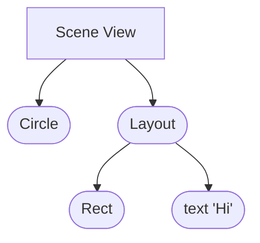

import Mermaid from '@theme/Mermaid';
import CodeBlock from '@theme/CodeBlock';
import ApiSnippet from '@site/src/components/Api/ApiSnippet';

# Scene hierarchy

Scenes are collections of nodes displayed in your animation. They're organized
in a tree hierarchy, with the scene view at its root. This concept is similar to
the Document Object Model used to represent HTML and XML documents.

Here's an example of a simple scene hierarchy together with its object
representation:

<div className="row margin-bottom--md">
  <div className="col col--6">

```tsx
view.add(
  <>
    <Circle />
    <Layout>
      <Rect />
      <Text>Hi</Text>
    </Layout>
  </>,
);
```

  </div>
  <div className="col col--6">



  </div>
</div>

Each node is an instance of a class extending the base [`Node`][node] class. To
make the code more readable, Motion Canvas uses a custom
[JSX](https://reactjs.org/docs/introducing-jsx.html) runtime. This way, instead
of instantiating the nodes ourselves, we can write an XML-like markup. Note that
Motion Canvas does **not** use React itself, only JSX. There's no virtual DOM or
reconciliation and the JSX tags are mapped directly to Node instances. These two
code snippets are equivalent:

<div className="row">
  <div className="col col--6">

```tsx
// JSX
view.add(
  <>
    <Circle />
    <Layout>
      <Rect />
      <Text>Hi</Text>
    </Layout>
  </>,
);
```

  </div>
  <div className="col col--6">

```tsx
// No JSX
view.add([
  new Circle({}),
  new Layout({
    children: [
      // highlight-start
      new Rect({}),
      new Text({text: 'Hi'}),
    ],
  }),
]);
```

  </div>
</div>

Just like with DOM, it's possible to add, remove, and rearrange nodes at any
time. The [`Node`][node] class contains the
[`children`](/api/2d/components/Node#children) and
[`parent`](/api/2d/components/Node#parent) properties that can be used to
traverse the tree. But in order to modify it, it's recommended to use the
following helper methods:

## `Node.add`

<ApiSnippet url={'/api/2d/components/Node#add'} />
<hr />

## `Node.insert`

<ApiSnippet url={'/api/2d/components/Node#insert'} />
<hr />

## `Node.remove`

<ApiSnippet url={'/api/2d/components/Node#remove'} />
<hr />

## `Node.reparent`

<ApiSnippet url={'/api/2d/components/Node#reparent'} />
<hr />

## `Node.moveUp`

<ApiSnippet url={'/api/2d/components/Node#moveUp'} />
<hr />

## `Node.moveDown`

<ApiSnippet url={'/api/2d/components/Node#moveDown'} />
<hr />

## `Node.moveToTop`

<ApiSnippet url={'/api/2d/components/Node#moveToTop'} />
<hr />

## `Node.moveToBottom`

<ApiSnippet url={'/api/2d/components/Node#moveToBottom'} />
<hr />

## `Node.moveTo`

<ApiSnippet url={'/api/2d/components/Node#moveTo'} />
<hr />

## `Node.moveAbove`

<ApiSnippet url={'/api/2d/components/Node#moveAbove'} />
<hr />

## `Node.moveBelow`

<ApiSnippet url={'/api/2d/components/Node#moveBelow'} />
<hr />

## `Node.removeChildren`

<ApiSnippet url={'/api/2d/components/Node#removeChildren'} />
<hr />

[node]: /api/2d/components/Node
